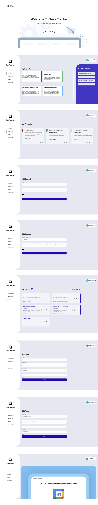

# App Title

TaskTracker

# App Overview

An application that allows users to create, organise, and track their tasks. User can log in, create tasks, set due dates, mark task as complete, and categorise task into different projects.

# Wireframe

# Screenshot

# Technologies used

- HTML
- CSS
- JavaScript
- Node.js
- Express.js
- EJS
- MongoDB
- Mongoose
- Passport.js
- Figma
- Render

# Getting Started

# [App Url](https://tasktracker-tyjo.onrender.com/)

# [Trello board](https://trello.com/b/n6fC5Nhs/task-manager)

# Next Steps

- Integrate the Google API
- Integrate Chart.js API
- Add Task Reminder / Push Notification
- Add filter/sort functionality
- Add search functionality
